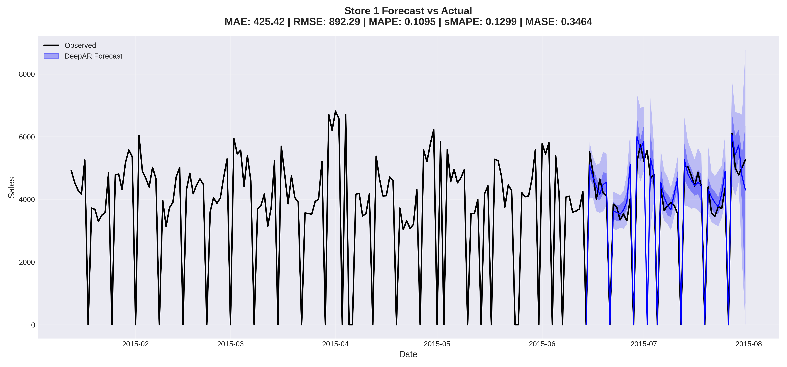

# DeepAR — Rossmann Store Sales Forecasting

**Probabilistic time-series forecasting with DeepAR applied to the Rossmann Store Sales dataset.**

## Project overview

A complete pipeline that trains a DeepAR model (GluonTS, PyTorch) to forecast daily sales for Rossmann stores. It produces probabilistic predictions, per-store metrics, and useful plots for analysis. The goal is to model store-level sales patterns such as trend, promotions, holidays, and weekly seasonality to forecast 48 days ahead. DeepAR predicts a distribution instead of a single value, which helps with planning, uncertainty handling, and decision-making.

## DeepAR?

DeepAR is an autoregressive recurrent neural model for time-series forecasting that models the conditional distribution of the next time step given history. Implementations often produce samples from the predictive distribution or quantiles.
* **DeepAR can**

  * Handle many related time series (e.g., many stores) simultaneously and learns shared patterns.
  * Support static categorical features (store type, assortment), dynamic known features (promotions, school holidays), and probabilistic outputs.
  * Pproduce probabilistic forecasts (not just one number) and handle irregular or noisy sales data well.

## About the Rossmann dataset

* **Rossmann** is a retail dataset (store sales) commonly used in forecasting benchmarks and competitions.
* **What the dataset contains (used here):**

  * `train.csv` — daily sales history per store (Date, Store, Sales, Promo, StateHoliday, SchoolHoliday, ...).
  * `store.csv` — store-level metadata (StoreType, Assortment, CompetitionDistance, ...).
* **Target and features used (simple & clear):**

  * **Target:** `Sales` (daily sales per store).
  * **Static categorical features:** encoded `Store`, `StoreType`, `Assortment` (used as `feat_static_cat` for DeepAR).
  * **Dynamic (time-varying) features:** `Promo`, `SchoolHoliday`, mapped `StateHoliday` (used as `feat_dynamic_real` — known in the future).
  * **Dates / frequency:** Daily time series.

## Pipeline (step-by-step)

1. **Environment & dependencies**
   Install libraries and set random seeds.

2. **Data loading & merge**
   Load `train.csv` and `store.csv`, convert `Date` to datetime, merge store metadata, impute `CompetitionDistance` median where missing.

3. **Clean time series**
   Ensure each store has a complete, equal-length series (filters incomplete stores), sort by date and store.

4. **Feature engineering & encoding**

   * Convert static features (`Store`, `StoreType`, `Assortment`) to categorical codes and capture cardinalities.
   * Map `StateHoliday` to numeric.
   * Build dynamic features (`Promo`, `SchoolHoliday`, `StateHoliday_cat`) per store.

5. **Prepare GluonTS datasets**

   * Reshape `Sales` into per-store series, split training sequences (exclude last `prediction_length`) and full test series.
   * Prepare `feat_static_cat`, `feat_dynamic_real`, and `start` timestamps and create `ListDataset` for train and test.

6. **Model (DeepAR) setup & training**

   * Configure `DeepAREstimator` with the project hyperparameters (see config section).
   * Train the model.

7. **Evaluation**

   * Use `make_evaluation_predictions` + `Evaluator` to compute: MAE, MAPE, sMAPE, MASE, RMSE and store per-store + global metrics.
   * Global and per-store CSVs are saved.

8. **Visualization & diagnostics**

   * Plot forecasts vs actuals for example stores.
   * Plot error distribution + Q–Q plot for residual analysis.

## Basic configuration & important variables

Configurations are centralized in a `Config` class.

* **Time series**

  * `FREQ = "D"` (daily)
  * `PREDICTION_LENGTH = 48` (forecast horizon)
  * `SEASONALITY_PERIOD = 7` (weekly seasonality for evaluator)

* **DeepAR hyperparameters**

  * `context_length = 2 * prediction_length = 96`
  * `num_layers = 3`
  * `hidden_size = 64`
  * `dropout_rate = 0.1`
  * `lr = 1e-3` (learning rate)
  * `epochs = 30`
  * `batch_size = 32`
  * `num_batches_per_epoch = 400`

* **Evaluation**

  * `NUM_SAMPLES = 100` (samples to draw from predictive distribution)
  * `QUANTILES = [0.1, 0.5, 0.9]`

## Results

**Global metrics (average across all stores)**

| Metric |                   Value |
| ------ | ----------------------: |
| MAE    |   **796.37** |
| MAPE   |  **0.1321** |
| sMAPE  | **0.1526** |
| MASE   | **0.3964** |
| RMSE   |   **1414.95** |

**Example forecast snapshot — Store 1**  

